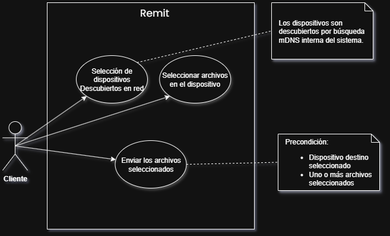

# Remit

Software de transferencia de archivos localmente (peer-to-peer) entre dispositivos, sin servidor central.

Funciona mediante el descubrimiento de dispositivos mediante mDNS que se encuentren con el software en ejecución para la transferencia de archivos por FTP.

#### Plataformas compatibles

- Windows
- Linux
- MacOS (en desarrollo)

#### Funcionamiento

#### Tecnologías utilizadas

- Tauri
- Rust
- Typescript
- React
- TailwindCSS
