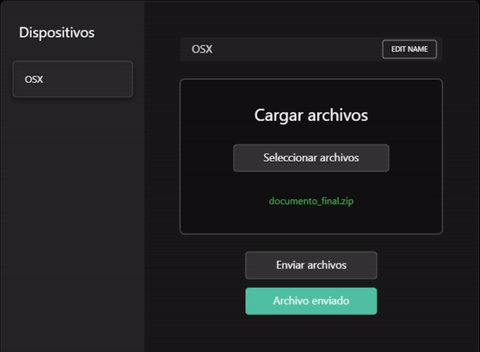

# Remit

---
**Remit** - Aplicación de escritorio multiplataforma para transferencia de archivos _peer-to-peer_ en red local, sin servidor central. Descubre dispositivos por mDNS y transfiere vía FTP.

#### Descargar

Los instaladores para las diferentes plataformas se encuentran en la sección [Releases](https://github.com/osx-mn/Remit/releases).

#### Uso

Al iniciar Remit, detecta automáticamente otros dispositivos en la misma red local que estén ejecutando la aplicación, permitiendo enviar archivos directamente.



#### Instalación

###### Compilar desde el código fuente

```bash
git clone https://github.com/osx-mn/Remit.git
cd Remit
bun install
```

> Reemplaza `bun install` por `npm install` si prefieres npm.

Remit usa [Tauri](https://tauri.app/) + Rust. La compilación de Android requiere **Ninja** como generador de CMake (el generador por defecto falla al compilar `aws-lc-sys`). Las ejecuciones de los comandos personalizados guardan la salida en archivos fechados dentro de `logs/`.

##### Windows

Los comandos personalizados configuran y limpian automáticamente las variables de entorno necesarias para cada plataforma:

```bash
bun run desktop:dev      # Modo desarrollo (escritorio)
bun run desktop:build    # Build de producción (escritorio)
bun run android:dev      # Modo desarrollo (Android)
bun run android:build    # Build de producción (Android)
```

El desarrollo de Android usa `AWS_LC_SYS_NO_ASM=1` por defecto para evitar requerir Perl/NASM. Para compilar usando ensamblador, ejecuta `bun run android:dev -- -Asm`. El build de producción genera APKs release, los alinea y firma con un keystore ubicado fuera del repositorio; si no existe, el comando lo crea y solicita su contraseña. También intenta instalar el APK correspondiente mediante `adb`. Para omitir la instalación, usa `bun run android:build -- -NoInstall`.

La compilación Android en Windows requiere `ANDROID_HOME` apuntando al Android SDK, Android Build Tools, `adb` y Java (`keytool`). Puedes configurar el keystore y sus credenciales mediante `TAURI_KEYSTORE`, `TAURI_KEY_ALIAS` y `TAURI_KS_PASS`.

##### macOS / Linux

Instala Ninja (`brew install ninja` en macOS, `apt install ninja-build` en Linux) y configura las variables de entorno manualmente para Android:

```bash
# Escritorio - desarrollo
cargo tauri dev

# Escritorio - build de producción
cargo tauri build

# Android - desarrollo
export AWS_LC_SYS_NO_ASM=1   # solo en debug, evita requerir Perl/NASM
export CMAKE_GENERATOR=Ninja
export AWS_LC_SYS_CMAKE_GENERATOR=Ninja
cargo tauri android dev

# Android - build
export CMAKE_GENERATOR=Ninja
export AWS_LC_SYS_CMAKE_GENERATOR=Ninja
cargo tauri android build
```

> Los soportes en Linux/MacOS/IOs no están probados aún oficialmente — si lo pruebas, feedback y PRs son bienvenidos.

#### Licencia

MIT